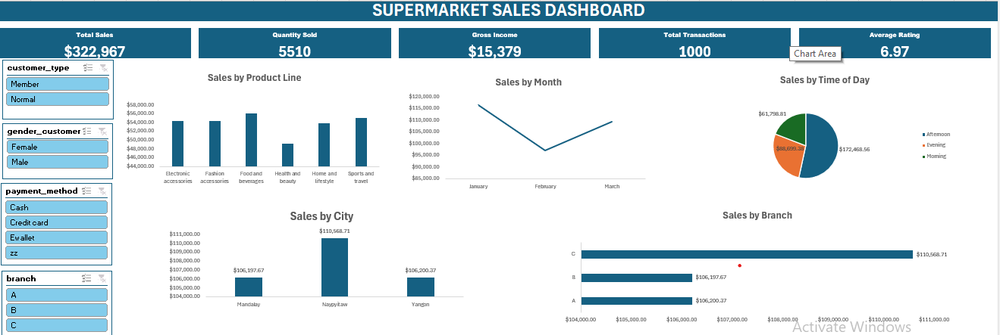

# 📊 Supermarket Sales Dashboard | Microsoft Excel
Interactive Excel dashboard built to analyze supermarket sales performance, uncover business insights, and support data-driven decision-making.

## Overview

Raw data is valuable, but only when it helps answer business questions.

In this project, I transformed over 1,000 supermarket sales records into an interactive Excel dashboard that enables decision-makers to monitor sales performance, identify trends, and explore business metrics through dynamic filtering.

Rather than simply presenting charts, the dashboard was designed to help answer key business questions quickly and support informed decision-making.

## Business Problem

A supermarket collects hundreds of transactions daily across multiple branches, product lines, customer groups, and payment methods.

Without a centralized dashboard, identifying sales trends, top-performing branches, or high-revenue product lines becomes time-consuming and inefficient.

This project addresses that challenge by consolidating key performance metrics into a single interactive dashboard.

## Project Objectives

* Clean and prepare the raw dataset for analysis.
* Build an interactive Excel dashboard.
* Track key performance indicators (KPIs).
* Compare sales across branches, cities, product lines, and time periods.
* Enable users to filter results dynamically using slicers.

## Dataset

* Dataset: Supermarket Sales Dataset
* Records: 1,000 transactions
* Columns: 17
* Data Includes:
    * Branch
    * City
    * Product Line
    * Customer Type
    * Gender
    * Payment Method
    * Quantity Sold
    * Gross Income
    * Rating
    * Date & Time
    * Total Sales
    * 

## Tools & Techniques

* Microsoft Excel
* Data Cleaning
* Pivot Tables
* Pivot Charts
* Slicers
* KPI Cards
* Dashboard Design
* Data Visualization

## Dashboard Features

The dashboard includes:

* Total Sales KPI
* Quantity Sold KPI
* Gross Income KPI
* Total Transactions KPI
* Average Customer Rating KPI
* Sales by Product Line
* Monthly Sales Trend
* Sales by Time of Day
* Sales by City
* Sales by Branch
* Interactive slicers for:
    * Customer Type
    * Gender
    * Payment Method
    * Branch

## Key Business Insights

📍 Branch Performance

Branch C generated the highest total sales ($110,568.71), making it the strongest-performing branch.

📍 City Performance

Naypyitaw recorded the highest sales among the three cities, while Yangon and Mandalay delivered similar levels of revenue.

📍 Product Performance

Food & Beverages emerged as the top-performing product line, whereas Health & Beauty generated the lowest sales.

📍 Sales Trend

Sales declined during February before recovering in March, indicating a temporary slowdown followed by renewed growth.

📍 Time-of-Day Analysis

The Afternoon period generated the highest sales, while Evening contributed the lowest share of revenue.

## Business Recommendations

Based on the analysis, the following actions are recommended:

* Maintain adequate inventory for high-performing product lines such as Food & Beverages.
* Investigate the operational strategies of Branch C and replicate successful practices across other branches.
* Review the factors behind the February sales dip to reduce similar slowdowns in the future.
* Schedule staffing and promotions around afternoon peak sales periods.
* Use the dashboard’s interactive slicers to analyze trends by customer type, gender, payment method, and branch for more targeted decision-making.

  Markdown
## Dashboard Preview

## Project Files

Supermarket_Sales_Dashboard_Excel
- README.md
- Supermarket_Sales_Dashboard.xlsx
- Dashboard.png
- Dataset.xlsx

## Skills Demonstrated

* Data Cleaning
* Business Analysis
* Dashboard Development
* KPI Reporting
* Data Visualization
* Interactive Reporting
* Analytical Thinking
* Excel for Business Intelligence

## What I Learned

Building dashboards goes beyond creating charts. The real value lies in translating data into insights that help stakeholders make faster, more informed business decisions.

This project strengthened my ability to analyze business performance, identify trends, and communicate findings through clear, interactive visualizations.

## Future Improvements

* Add Profit Margin Analysis.
* Build a customer segmentation dashboard.
* Introduce geographic mapping for branch performance.
* Recreate the dashboard in Power BI for enhanced interactivity.

